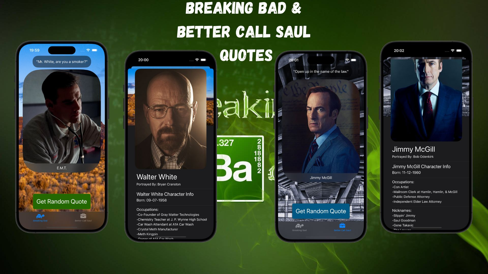

# BBQuotes

## Description

BBQuotes is a SwiftUI application that fetches and displays random quotes from the popular TV shows "Breaking Bad" and "Better Call Saul". Dive into the iconic dialogue from these shows and explore the characters behind the memorable lines.

## Features

- **Random Quote Display**: Tap the "Get Random Quote" button to fetch and display a random quote from the selected show.
- **Character Information**: View the character name and an image of the character associated with the displayed quote.
- **Dynamic Theming**: Supports both light and dark mode for optimal viewing experience.
- **Error Handling**: Handles potential errors such as bad network requests and invalid responses gracefully.

## Stretch Goals

- **iOS17**: This project will be updated to iOS17.

## Technologies Used

- **API**: Utilizes the Breaking Bad API to fetch random quotes and character information, seamlessly integrated within the ViewModel and FetchController components.
- **SwiftUI**: A modern framework for building user interfaces across all Apple platforms.
- **Xcode**: An integrated development environment (IDE) for macOS containing a suite of software development tools.
- **Swift**: A powerful and intuitive programming language for macOS, iOS, watchOS, and tvOS development.

## Credits

- This project is a tutorial from Kenneth Jones' [UDEMY Course](https://www.udemy.com/course/ios-15-app-development-with-swiftui-3-and-swift-5/?couponCode=KEEPLEARNING): "iOS 17, SwiftUI 5, & Swift 5.9: Build iOS Apps From Scratch".
- Original project idea and design by Kenneth Jones.
- This project is inspired by the popular TV shows "Breaking Bad" and "Better Call Saul".
- The Breaking Bad API used in this project is provided by [BREAKING BAD API](https://breaking-bad-api-six.vercel.app/api).

## Author

- [alcode111](https://github.com/alcode111)
